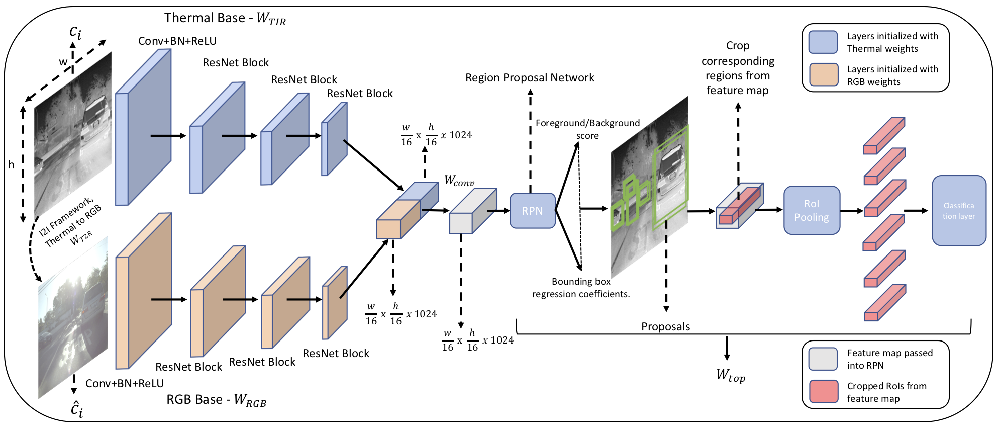

# Borrow from Anywhere: Pseudo Multimodal Object Detection in Thermal Domain.

[[Paper Link]](http://arxiv.org/abs/1905.08789)



**This repository is a modified fork of [jwyang/faster-rcnn.pytorch](https://github.com/jwyang/faster-rcnn.pytorch). We make use of [junyanz/pytorch-CycleGAN-and-pix2pix](https://github.com/junyanz/pytorch-CycleGAN-and-pix2pix/) and [mingyuliutw/UNIT](https://github.com/mingyuliutw/UNIT) for training the CycleGAN and  UNIT models for Thermal-to-RGB translation.**

## Preparation:

Clone the repository: 
```
https://github.com/tdchaitanya/MMTOD.git
```

Create a folder:

```
mkdir data
```

### prerequisites

* Python 3.6
* Pytorch 1.0
* CUDA 8.0 

### Data Preparation

* **FLIR ADAS**: FLIR ADAS dataset can be downloaded from [here](https://www.flir.in/oem/adas/adas-dataset-form/).

* **KAIST**: KAIST dataset can be downloaded [here](https://sites.google.com/site/pedestrianbenchmark/).

For ease of training, we convert all the annotations into PASCAL-VOC format. To convert the FLIR and KAIST datasets annotations into P-VOC format, use the scripts in the `generate_annotations` folder.

After converting the annotations, images and annotation files should be arranged in VOC format. The `data` directory should be organized as follows.

```
data
├── coco
├── pretrained_model --> resnet101_caffe.pth
└── VOCdevkit2007
    ├── VOC2007
        ├── Annotations
        ├── ImageSets
        │   └── Main --> trainval.txt, test.txt
        └── JPEGImages
```

`trainval.txt` and `test.txt` for FLIR, FLIR-(1/2) and FLIR-(1/4), KAIST datasets are provided in the google drive folder linked below. `test.txt` is the same for all the FLIR datasets.

### Pretrained Model: 
We'll be using pre-trained Resnet-101 model for the Faster-RCNN base. You can download the weights from:  

* ResNet101: [Dropbox](https://www.dropbox.com/s/iev3tkbz5wyyuz9/resnet101_caffe.pth?dl=0), [VT Server](https://filebox.ece.vt.edu/~jw2yang/faster-rcnn/pretrained-base-models/resnet101_caffe.pth)

Download them and put them into the `data/pretrained_model/` directory.

The Thermal-to-RGB translation networks and MMTOD take some decent amount of time to train. So for easy reproduction of results, we're sharing all the weight files, the shared folder is a bit large, so its recommended to only download the files corresponding to the model you wish to reproduce. 

* [Drive Link](https://drive.google.com/drive/folders/1Hz6h3WS_rX6wvaGr4duC3ctd90R_l0eS?usp=sharing)

### Compilation

Install all the python dependencies using pip:
```
pip install -r requirements.txt
```

Compile the cuda dependencies using following simple commands:

```
cd lib
python setup.py build develop
```

**As pointed out in this [issue](https://github.com/jwyang/faster-rcnn.pytorch/issues/16), if you encounter some error during the compilation, you might miss to export the CUDA paths to your environment.**

## Train

Pick the `trainval.txt` for FLIR dataset along with the `test.txt` and place them in `./data/VOCdevkit2007/VOC2007/ImageSets/Main/` folder. `trainval.txt` is different for each of FLIR, FLIR-1/2, and FLIR-1/4.

1.) **Single mode Faster-RCNN on FLIR ADAS:**

Once you complete all the above steps, training the baseline model should be simple. Execute the following command to start training: 

```
python trainval_net.py --dataset pascal_voc --net res101_thermal --bs 8 --nw 4 --epochs 15 --cuda --use_tfb 
```

2.) **MMTOD-UNIT**


For using the RGB branch of the network, you'll need to generate a pseudo-RGB image from the input thermal image. For this you'll need pre-trained Thermal-to-RGB `UNIT` weights, these can be downloaded from `unit/models` folder in [drive](https://drive.google.com/drive/folders/1Hz6h3WS_rX6wvaGr4duC3ctd90R_l0eS?usp=sharing) . Place these weights in `lib/model/unit/models`.

Along with `rgb2thermal.pt` you'll also need VGG16 weights, you can download them from this [link](https://www.dropbox.com/s/76l3rt4kyi3s8x7/vgg16.t7?dl=1), place it in the same folder along with `rgb2thermal.pt`.

Since we initialize the RGB and Thermal branches with pre-trained weights, you'll need the pre-trained weights for both the branches. 

Pre-trained weights for RGB branch can be found in the `MS-COCO/res101_coco`, `PASCAL-VOC/res101_pascal` and pre-trained weights for thermal branch can be found in `FLIR/res101_thermal` in this drive folder. Place the pre-trained thermal weights in `models/res101_thermal`

* **MS-COCO as RGB Branch**
Download pre-trained MS-COCO weights from `MS-COCO/res101_coco`and place them in the `models/res101_coco` folder. Start the training by running the following command:

```
python trainval_unit_update_coco.py --dataset pascal_voc --net res101_unit_update_coco --bs 1 --nw 4 --epochs 15 --cuda
```

* **PASCAL-VOC as RGB branch:**

Download the pre-trained PASCAL-VOC weights from `PASCAL-VOC/res101_pascal` and place them in the `models/res101_pascal` folder. Start the training by running the following command:

```
python trainval_unit_update.py --dataset pascal_voc --net res101_unit_update --bs 1 --nw 4 --epochs 15 --cuda --use_tfb
```

3.) **MMTOD-CycleGAN**

For Thermal-to-RGB translation you need the RGB-to-Thermal CycleGAN weights, these can be downloaded from `cgan/checkpoints/rg2thermal_flir` folder in the [drive](https://drive.google.com/drive/folders/1Hz6h3WS_rX6wvaGr4duC3ctd90R_l0eS?usp=sharing). Place these weights in `lib/model/cgan/checkpoints` 

* **MS-COCO as RGB Branch**
Download pre-trained MS-COCO weights from `MS-COCO/res101_coco`and place them in the `models/res101_coco` folder. Start the training by running the following command:

```
python trainval_cgan_update_coco.py --dataset pascal_voc --net res101_cgan_update_coco --bs 4 --nw 4 --epochs 15 --cuda --name rgb2thermal_flir --use_tfb
```
* **PASCAL-VOC as RGB branch:**

Download the pre-trained PASCAL-VOC weights from `PASCAL-VOC/res101_pascal` and place them in the `models/res101_pascal` folder. Start the training by running the following command:
```
python trainval_cgan_update.py --dataset pascal_voc --net res101_cgan_update --bs 4 --nw 4 --epochs 15 --cuda --name rgb2thermal_flir --use_tfb
```

## Training on FLIR-1/2 and FLIR-1/4
For training on FLIR-1/2 and FLIR-1/4, you need to change the `trainval.txt` file in `./data/VOCdevkit2007/VOC2007/ImageSets/Main/`. Replace it with the corresponding file from `FLIR-1/2`, `FLIR-1/4` folders shared in the [drive](https://drive.google.com/drive/folders/1Hz6h3WS_rX6wvaGr4duC3ctd90R_l0eS?usp=sharing). Follow the same procedure and commands listed above.


## Testing and Reproducing results in the paper.

### FLIR(full):

**Baseline:** Weights for the baseline are located in `FLIR/res101_thermal` folder in the drive. Place the folder as it is in `models` directory and run the following command: 

```
python test_net.py --dataset pascal_voc --net res101_thermal --checksession 1 --checkepoch 15 --checkpoint 1963 --cuda

```

**MMTOD-UNIT** 

1). **MS-COCO as RGB Branch**

Weights are located in `FLIR/res101_unit_update_coco` folder

Follow the instructions in the train section to use the Thermal-to-RGB weights. Execute the following command for seeing the results.

```
python test_net_unit_update.py --dataset pascal_voc --net res101_unit_update_coco --checksession 1 --checkepoch 15 --checkpoint 15717 --cuda 
```

2). **PASCAL-VOC as RGB Branch**

Weights are located in `FLIR/res101_unit_update` folder. 

As mentioned for the MS-COCO above, make sure to download the Thermal-to-RGB weight files and place them in the appropriate directory. Execute the following command for seeing the results.

```
python test_net_unit_update.py --dataset pascal_voc --net res101_unit_update --checksession 1 --checkepoch 15 --checkpoint 15717 --cuda 
```

**MMTOD-CGAN**

1). **MS-COCO as the RGB Branch:**

Weights are located in `FLIR/res101_cgan_update_coco` folder. 

Follow the instructions in the train section to use the Thermal-to-RGB weights. Execute the following command for seeing the results.

```
python test_net_cgan_update.py --dataset pascal_voc --net res101_cgan_update_coco --checksession 1 --checkepoch 15 --checkpoint 3928 --cuda --name rgb2thermal_flir
```

2). **PASCAL-VOC as RGB Branch**

Weights are located in `FLIR/res101_cgan_update` folder. 

As mentioned for the MS-COCO above, make sure to download the Thermal-to-RGB weight files and place them in the appropriate directory. Execute the following command for seeing the results.

```
python test_net_cgan_update.py --dataset pascal_voc --net res101_cgan_update --checksession 1 --checkepoch 15 --checkpoint 3928 --cuda --name rgb2thermal_flir

```

For reproducing the results on FLIR-1/2 and FLIR-1/4 datasets, download the weights from `FLIR-1/2` and `FLIR-1/4` directories from the shared [drive folder](https://drive.google.com/drive/folders/1Hz6h3WS_rX6wvaGr4duC3ctd90R_l0eS?usp=sharing).
